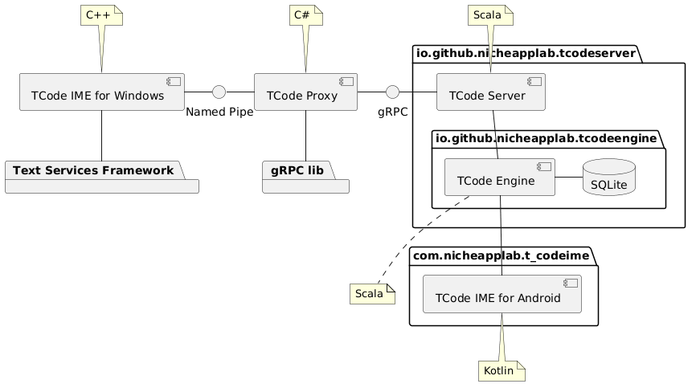

Android 用 T-Code IME として T-Code IME for Android をリリースする際に, エンジン
部分(T-Code Engine)を取り出し, 各プラットフォームで IME を提供するという構想があり
ました.

とはいえ, Windows 用の IME には Text Services Framework という C++ 用に提供され
たライブラリを使用するという制約上, Android 用と比較すると複雑な構成です.

- IME 本体である `TCode IME for Windows` は薄いラッパー
- バックグラウンドプロセスに `TCode Proxy`
- `TCode Proxy` は別の Java Thread (`Pekko Actor`) として `T-Code Engine` のサーバーを立てる
- そしてそれぞれ Windows Named Pipe と gPRC プロトコルを用いてローカルマシン上で通信する

T-Code IME for Android がこうした複雑な構成とならなかった理由は,ひとえに Android
アプリが Kotlin で書かれており, 同プロセス上に Scala で実装した T-Code Engine を
直接利用できたためでした.
