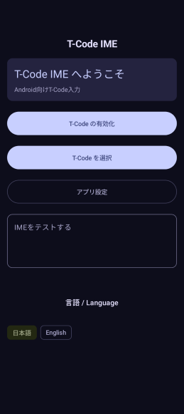
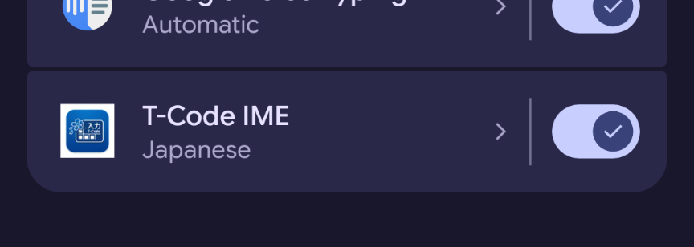
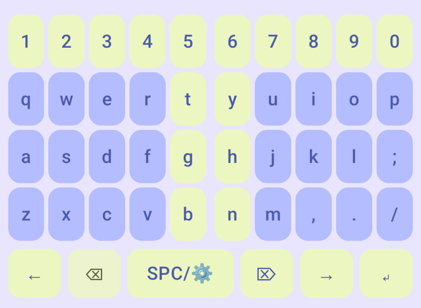

## インストール

Play ストアからインストールし,起動すると以下の画面になります.

ここで, 「T-Code の有効化」を選択すると, 以下の画面に遷移します.
この画面で T-Code IME の右側のスライダーで On にします.

続いて, アプリから「T-Code を選択」することで, 利用することができます.
試しに, 「IME をテストする」のテキストエリアを選択すると, 以下のキーボードが表示されます.
このキーボード上でキーストロークを入力することで, テキストエリアに文字が入力されます.

