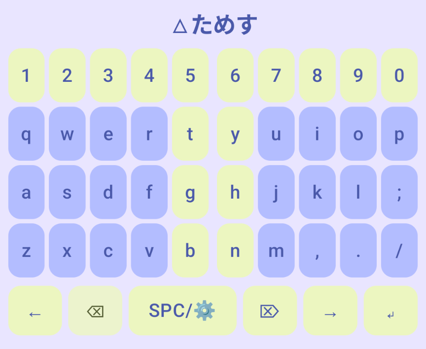
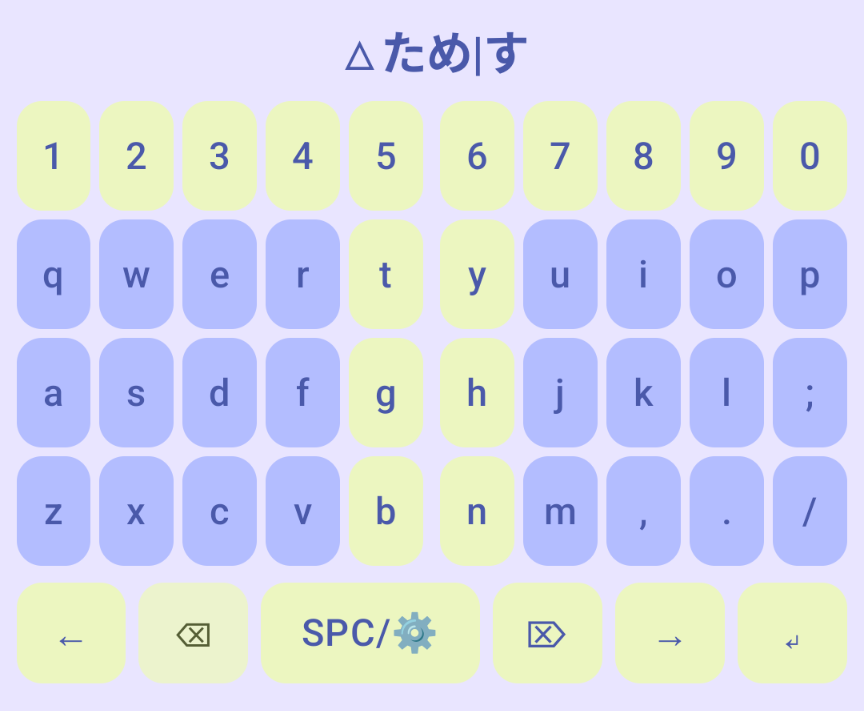
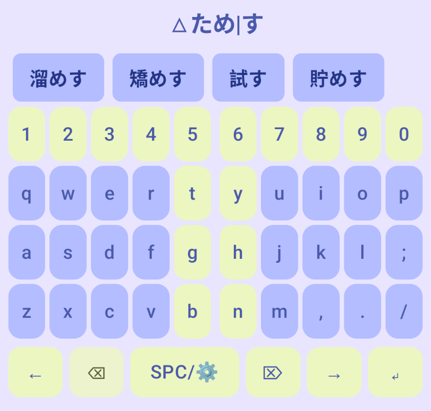

## 交ぜ書き変換

T-Code IME では前置式の交ぜ書き変換が利用できます.
キーボードで"fj"と入力することで, 交ぜ書き変換モードに移行します.
ここで,「試す」を入力してみましょう.
まずは「ためす」を入力します("kslc,f").

次に変換対象の活用の範囲を指定します.
キーボード左下部の"←"ボタンにタッチすると, 交ぜ書きモードでは活用指定モードになります.
ここで表示される「|」より右が活用の範囲になります.
「|」が表示されていない, または「|」を末尾に移動させることで, 活用がないものと指定することができます.

SPC をタップすることで変換候補が表示され, 候補をタップで入力を確定します.

